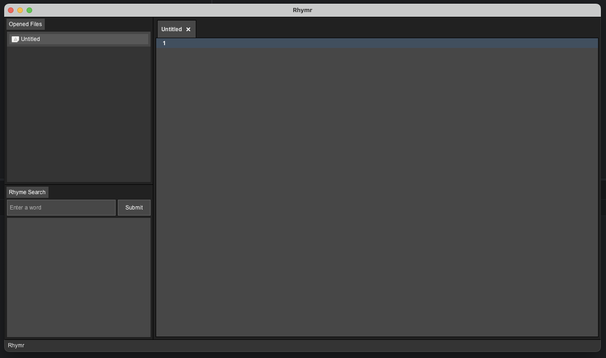

# Rhymr

**Rhymr** is a lightning-fast, distraction-free text editor built in Rust for poets, lyricists, and MCs. Designed with native GTK4 performance, it combines core songwriting utilities into an integrated workspace.

# ⚠️
> **Note:** Rhymr is still **work in progress** with **no release available**

## Features

* **Blazing Fast**: Native Rust Architecture powered by GTK4
* **Syllable Counter**: Real-time syllable tracking to keep you locked in.
* **Built-in Rhyme Search**: Instant lookup powered by the Datamuse API.
* **Multi-Platform**: Built for use on Windows & Mac Systems.

## Showcase



### Quick Start

#### Prerequisites

> [See Cargo.toml](https://github.com/rhymr/win-mac/blob/main/Cargo.toml)

#### 1. **Clone the repository**:
```bash
git clone https://github.com/rhymr/win-mac.git
cd rhymr-win-mac
```
#### 2. **Build and run**:
```bash
cargo run --release
```

### License

Distributed under the MIT License. See `LICENSE` for more information.